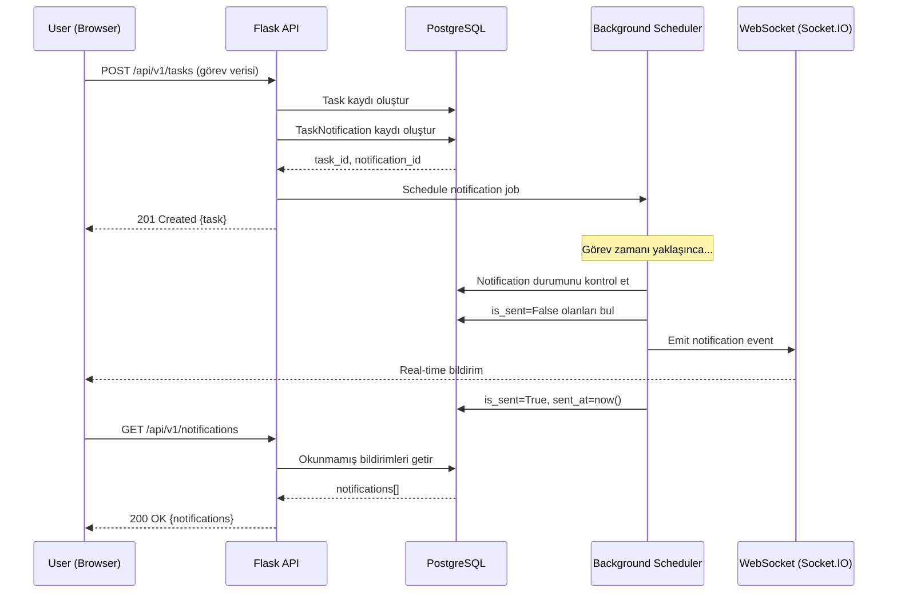
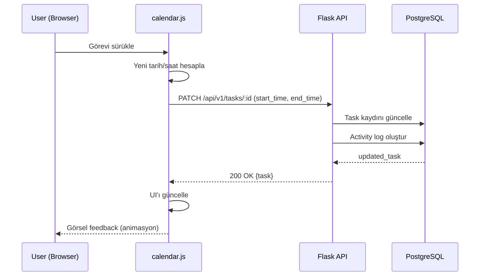

# Takvim ve Görev Yönetimi Sistemi - Teknik Tasarım Belgesi

## Genel Bakış

Bu belge, WhatsApp CRM SaaS uygulamasına eklenecek kapsamlı Takvim ve Görev Yönetimi sisteminin teknik tasarımını tanımlar. Sistem, kullanıcıların görevleri oluşturmasını, takip etmesini, takvim görünümünde görselleştirmesini ve bildirimler almasını sağlayacaktır.

### Hedefler

1. **Gelişmiş Görev Yönetimi**: Mevcut Task modelini genişleterek zamanlama, kategorizasyon ve durum takibi eklemek
2. **Etkileşimli Takvim Arayüzü**: Sürükle-bırak, yeniden boyutlandırma ve hızlı aksiyonlar içeren modern takvim UI
3. **Akıllı Bildirim Sistemi**: Görev zamanı yaklaşınca veya geçince otomatik bildirimler
4. **Multi-tenant İzolasyon**: Workspace bazlı veri izolasyonu ve güvenlik
5. **Performans Optimizasyonu**: Render Free Plan (512MB RAM) için optimize edilmiş sorgu ve cache stratejileri

### Hedef Olmayanlar

- Tekrarlayan görevler (recurring tasks) - gelecek iterasyonda eklenecek
- Harici takvim entegrasyonu (Google Calendar, Outlook) - gelecek iterasyonda
- Video konferans entegrasyonu - kapsam dışı
- Mobil native uygulama - web responsive yeterli

## Mimari

### Sistem Bileşenleri

```
┌─────────────────────────────────────────────────────────────────┐
│                         Frontend Layer                           │
├─────────────────────────────────────────────────────────────────┤
│  calendar.js            │  Takvim görünümü ve etkileşimler      │
│  task-modal.js          │  Görev oluşturma/düzenleme modalı     │
│  notification-bell.js   │  Bildirim zili ve dropdown            │
│  drag-drop-handler.js   │  Sürükle-bırak ve resize logic        │
└─────────────────────────────────────────────────────────────────┘
                              ↓ HTTP/JSON + Socket.IO
┌─────────────────────────────────────────────────────────────────┐
│                          API Layer                               │
├─────────────────────────────────────────────────────────────────┤
│  routes/calendar.py     │  Takvim endpoint'leri                 │
│  routes/tasks.py        │  Görev CRUD endpoint'leri (mevcut)    │
│  routes/notifications.py│  Bildirim endpoint'leri               │
└─────────────────────────────────────────────────────────────────┘
                              ↓
┌─────────────────────────────────────────────────────────────────┐
│                        Service Layer                             │
├─────────────────────────────────────────────────────────────────┤
│  TaskService            │  Görev business logic                 │
│  CalendarService        │  Takvim view logic                    │
│  NotificationService    │  Bildirim yönetimi                    │
│  TaskScheduler          │  Background job scheduler             │
└─────────────────────────────────────────────────────────────────┘
                              ↓
┌─────────────────────────────────────────────────────────────────┐
│                         Data Layer                               │
├─────────────────────────────────────────────────────────────────┤
│  Task Model (extended)  │  Görev veri modeli                    │
│  TaskNotification       │  Bildirim kayıtları                   │
│  NotificationPreference │  Kullanıcı bildirim tercihleri        │
└─────────────────────────────────────────────────────────────────┘
```

### Teknoloji Stack

- **Frontend**: Vanilla JavaScript, Tailwind CSS, FullCalendar.js (veya custom implementation)
- **Backend**: Flask, SQLAlchemy, PostgreSQL
- **Real-time**: Socket.IO (gevent async_mode)
- **Background Jobs**: APScheduler (gevent compatible)
- **Timezone**: pytz library
- **Deploy**: Render Free Plan (512MB RAM, gevent worker)


## Ana Akış Diyagramı

### Görev Oluşturma ve Bildirim Akışı



### Takvim Sürükle-Bırak Akışı




## Bileşenler ve Arayüzler

### Backend Bileşenleri

#### 1. Veri Modelleri (models_crm.py)

##### Task Model (Mevcut - Genişletilecek)

**Mevcut Durum:**
```python
class Task(db.Model):
    __tablename__ = 'tasks'
    
    id = db.Column(db.Integer, primary_key=True)
    workspace_id = db.Column(db.Integer, db.ForeignKey('workspaces.id'), nullable=False, index=True)
    title = db.Column(db.String(200), nullable=False)
    description = db.Column(db.Text)
    assignee_id = db.Column(db.Integer, db.ForeignKey('users.id'), nullable=True, index=True)
    company_id = db.Column(db.Integer, db.ForeignKey('companies.id'), nullable=True, index=True)
    deal_id = db.Column(db.Integer, db.ForeignKey('deals.id'), nullable=True, index=True)
    milestone_id = db.Column(db.Integer, db.ForeignKey('milestones.id'), nullable=True, index=True)
    status = db.Column(db.String(50), default='not_started', nullable=False, index=True)
    priority = db.Column(db.String(20), default='medium')
    due_date = db.Column(db.DateTime)
    is_customer_facing = db.Column(db.Boolean, default=False)
    created_at = db.Column(db.DateTime, default=datetime.utcnow, nullable=False)
    updated_at = db.Column(db.DateTime, default=datetime.utcnow, onupdate=datetime.utcnow)
    completed_at = db.Column(db.DateTime)
```

**Eklenecek Kolonlar:**
```python
# Zamanlama alanları
start_time = db.Column(db.DateTime, nullable=True, index=True)  # Başlangıç zamanı (tarih + saat)
end_time = db.Column(db.DateTime, nullable=True, index=True)    # Bitiş zamanı (tarih + saat)
timezone = db.Column(db.String(50), default='UTC', nullable=False)  # Timezone (örn: 'Europe/Istanbul')

# Kategorizasyon
task_type = db.Column(db.String(50), default='task', nullable=False, index=True)
# Değerler: 'call', 'meeting', 'email', 'todo', 'follow_up', 'other'

# İlişkiler (mevcut modelde zaten var, sadece contact_id eksik)
contact_id = db.Column(db.Integer, db.ForeignKey('contacts.id'), nullable=True, index=True)

# Durum genişletmesi (mevcut status kolonu kullanılacak)
# Değerler: 'pending', 'completed', 'cancelled', 'overdue'
```

**Yeni İndeksler:**
```python
__table_args__ = (
    db.Index('idx_task_workspace_start_time', 'workspace_id', 'start_time'),
    db.Index('idx_task_workspace_status', 'workspace_id', 'status'),
    db.Index('idx_task_assignee_status', 'assignee_id', 'status'),
    db.Index('idx_task_type', 'task_type'),
)
```

**Yeni Metodlar:**
```python
def is_overdue(self) -> bool:
    """Görevin süresi geçmiş mi kontrol et"""
    if self.status in ['completed', 'cancelled']:
        return False
    if not self.end_time:
        return False
    return datetime.utcnow() > self.end_time

def duration_minutes(self) -> Optional[int]:
    """Görev süresi (dakika)"""
    if not self.start_time or not self.end_time:
        return None
    delta = self.end_time - self.start_time
    return int(delta.total_seconds() / 60)

def to_calendar_event(self) -> dict:
    """Takvim event formatına dönüştür"""
    return {
        'id': self.id,
        'title': self.title,
        'start': self.start_time.isoformat() if self.start_time else None,
        'end': self.end_time.isoformat() if self.end_time else None,
        'type': self.task_type,
        'status': self.status,
        'assignee_id': self.assignee_id,
        'color': self._get_color_by_type(),
        'editable': True,
        'extendedProps': {
            'description': self.description,
            'priority': self.priority,
            'contact_id': self.contact_id,
            'company_id': self.company_id,
            'deal_id': self.deal_id,
        }
    }

def _get_color_by_type(self) -> str:
    """Görev tipine göre renk"""
    colors = {
        'call': '#10b981',      # green
        'meeting': '#3b82f6',   # blue
        'email': '#8b5cf6',     # purple
        'todo': '#f59e0b',      # amber
        'follow_up': '#ec4899', # pink
        'other': '#6b7280',     # gray
    }
    return colors.get(self.task_type, '#6b7280')
```


##### TaskNotification Model (Yeni)

```python
class TaskNotification(db.Model):
    """
    Görev bildirimleri için kayıt tablosu.
    Her görev için birden fazla bildirim oluşturulabilir (örn: 15dk önce, görev zamanında).
    """
    __tablename__ = 'task_notifications'
    
    id = db.Column(db.Integer, primary_key=True)
    workspace_id = db.Column(db.Integer, db.ForeignKey('workspaces.id'), nullable=False, index=True)
    task_id = db.Column(db.Integer, db.ForeignKey('tasks.id'), nullable=False, index=True)
    user_id = db.Column(db.Integer, db.ForeignKey('users.id'), nullable=False, index=True)
    
    # Bildirim zamanlaması
    notify_at = db.Column(db.DateTime, nullable=False, index=True)  # Ne zaman bildirim gönderilecek
    
    # Bildirim içeriği
    message = db.Column(db.String(500), nullable=False)
    notification_type = db.Column(db.String(50), default='task_reminder', nullable=False)
    # Değerler: 'task_reminder', 'task_overdue', 'task_assigned', 'task_updated'
    
    # Durum takibi
    is_sent = db.Column(db.Boolean, default=False, nullable=False, index=True)
    sent_at = db.Column(db.DateTime, nullable=True)
    is_read = db.Column(db.Boolean, default=False, nullable=False, index=True)
    read_at = db.Column(db.DateTime, nullable=True)
    
    created_at = db.Column(db.DateTime, default=datetime.utcnow, nullable=False)
    
    # İlişkiler
    task = db.relationship('Task', backref=db.backref('notifications', lazy=True, cascade='all, delete-orphan'))
    
    __table_args__ = (
        db.Index('idx_notification_pending', 'is_sent', 'notify_at'),
        db.Index('idx_notification_user_unread', 'user_id', 'is_read'),
        db.Index('idx_notification_workspace_user', 'workspace_id', 'user_id'),
    )
    
    def __repr__(self):
        return f'<TaskNotification task_id={self.task_id} user_id={self.user_id}>'
    
    def mark_as_sent(self):
        """Bildirimi gönderildi olarak işaretle"""
        self.is_sent = True
        self.sent_at = datetime.utcnow()
    
    def mark_as_read(self):
        """Bildirimi okundu olarak işaretle"""
        self.is_read = True
        self.read_at = datetime.utcnow()
```

##### NotificationPreference Model (Yeni)

```python
class NotificationPreference(db.Model):
    """
    Kullanıcı bildirim tercihleri.
    Her kullanıcı hangi tür bildirimleri almak istediğini ayarlayabilir.
    """
    __tablename__ = 'notification_preferences'
    
    id = db.Column(db.Integer, primary_key=True)
    workspace_id = db.Column(db.Integer, db.ForeignKey('workspaces.id'), nullable=False, index=True)
    user_id = db.Column(db.Integer, db.ForeignKey('users.id'), nullable=False, index=True)
    
    # Bildirim tercihleri (boolean flags)
    task_reminder_enabled = db.Column(db.Boolean, default=True, nullable=False)
    task_overdue_enabled = db.Column(db.Boolean, default=True, nullable=False)
    task_assigned_enabled = db.Column(db.Boolean, default=True, nullable=False)
    task_updated_enabled = db.Column(db.Boolean, default=False, nullable=False)
    
    # Hatırlatma zamanı (görev başlangıcından kaç dakika önce)
    reminder_minutes_before = db.Column(db.Integer, default=15, nullable=False)
    # Değerler: 0, 5, 10, 15, 30, 60, 120, 1440 (1 gün)
    
    created_at = db.Column(db.DateTime, default=datetime.utcnow, nullable=False)
    updated_at = db.Column(db.DateTime, default=datetime.utcnow, onupdate=datetime.utcnow)
    
    __table_args__ = (
        db.UniqueConstraint('workspace_id', 'user_id', name='uix_notification_pref_workspace_user'),
    )
    
    def __repr__(self):
        return f'<NotificationPreference user_id={self.user_id}>'
```


#### 2. Service Layer

##### TaskService (services/task_service.py - Genişletilecek)

**Sorumluluklar:**
- Görev CRUD işlemleri
- Görev zamanlama ve güncelleme
- Durum geçişleri (pending → completed, overdue kontrolü)
- Bildirim oluşturma
- Takvim event dönüşümü

**Ana Fonksiyonlar:**

```python
class TaskService:
    
    @staticmethod
    def create_task(workspace_id: int, user_id: int, data: dict) -> Task:
        """
        Yeni görev oluştur ve bildirim kayıtları oluştur.
        
        Args:
            workspace_id: Workspace ID
            user_id: Görevi oluşturan kullanıcı ID
            data: Görev verisi
                {
                    'title': str,
                    'description': str,
                    'start_time': datetime,
                    'end_time': datetime,
                    'timezone': str,
                    'task_type': str,
                    'assignee_id': int,
                    'contact_id': int,
                    'company_id': int,
                    'deal_id': int,
                    'priority': str,
                }
        
        Returns:
            Task: Oluşturulan görev
        
        Raises:
            ValueError: Geçersiz veri
        """
        # Validasyon
        if not data.get('title'):
            raise ValueError("Görev başlığı zorunludur")
        
        if data.get('start_time') and data.get('end_time'):
            if data['start_time'] >= data['end_time']:
                raise ValueError("Bitiş zamanı başlangıç zamanından sonra olmalıdır")
        
        # Görev oluştur
        task = Task(
            workspace_id=workspace_id,
            title=data['title'],
            description=data.get('description'),
            start_time=data.get('start_time'),
            end_time=data.get('end_time'),
            timezone=data.get('timezone', 'UTC'),
            task_type=data.get('task_type', 'task'),
            assignee_id=data.get('assignee_id'),
            contact_id=data.get('contact_id'),
            company_id=data.get('company_id'),
            deal_id=data.get('deal_id'),
            priority=data.get('priority', 'medium'),
            status='pending',
        )
        
        db.session.add(task)
        db.session.flush()  # ID almak için
        
        # Bildirim oluştur
        if task.start_time and task.assignee_id:
            TaskService._create_task_notifications(task)
        
        # Activity log
        TaskService._create_activity_log(
            workspace_id=workspace_id,
            user_id=user_id,
            task_id=task.id,
            action='task_created',
            details=f"Görev oluşturuldu: {task.title}"
        )
        
        db.session.commit()
        return task
    
    @staticmethod
    def update_task(workspace_id: int, task_id: int, user_id: int, data: dict) -> Task:
        """
        Görevi güncelle.
        
        Args:
            workspace_id: Workspace ID
            task_id: Görev ID
            user_id: Güncelleyen kullanıcı ID
            data: Güncellenecek alanlar
        
        Returns:
            Task: Güncellenmiş görev
        """
        task = Task.query.filter_by(
            id=task_id,
            workspace_id=workspace_id
        ).first()
        
        if not task:
            raise ValueError("Görev bulunamadı")
        
        # Zaman değişikliği kontrolü
        time_changed = False
        if 'start_time' in data and data['start_time'] != task.start_time:
            time_changed = True
            task.start_time = data['start_time']
        
        if 'end_time' in data and data['end_time'] != task.end_time:
            time_changed = True
            task.end_time = data['end_time']
        
        # Diğer alanları güncelle
        for field in ['title', 'description', 'task_type', 'priority', 'status', 
                     'assignee_id', 'contact_id', 'company_id', 'deal_id', 'timezone']:
            if field in data:
                setattr(task, field, data[field])
        
        task.updated_at = datetime.utcnow()
        
        # Durum değişikliği
        if 'status' in data and data['status'] == 'completed':
            task.completed_at = datetime.utcnow()
        
        # Zaman değişti ise bildirimleri yeniden oluştur
        if time_changed and task.assignee_id:
            # Eski bildirimleri sil (henüz gönderilmemişleri)
            TaskNotification.query.filter_by(
                task_id=task.id,
                is_sent=False
            ).delete()
            
            # Yeni bildirimler oluştur
            TaskService._create_task_notifications(task)
        
        # Activity log
        TaskService._create_activity_log(
            workspace_id=workspace_id,
            user_id=user_id,
            task_id=task.id,
            action='task_updated',
            details=f"Görev güncellendi: {task.title}"
        )
        
        db.session.commit()
        return task
    
    @staticmethod
    def _create_task_notifications(task: Task):
        """
        Görev için bildirim kayıtları oluştur.
        
        Args:
            task: Task instance
        """
        # Kullanıcı tercihlerini al
        pref = NotificationPreference.query.filter_by(
            workspace_id=task.workspace_id,
            user_id=task.assignee_id
        ).first()
        
        if not pref:
            # Varsayılan tercihler
            pref = NotificationPreference(
                workspace_id=task.workspace_id,
                user_id=task.assignee_id,
                reminder_minutes_before=15
            )
            db.session.add(pref)
        
        # Hatırlatma bildirimi
        if pref.task_reminder_enabled and task.start_time:
            notify_at = task.start_time - timedelta(minutes=pref.reminder_minutes_before)
            
            # Geçmiş zaman kontrolü
            if notify_at > datetime.utcnow():
                notification = TaskNotification(
                    workspace_id=task.workspace_id,
                    task_id=task.id,
                    user_id=task.assignee_id,
                    notify_at=notify_at,
                    message=f"Hatırlatma: '{task.title}' görevi {pref.reminder_minutes_before} dakika içinde başlayacak",
                    notification_type='task_reminder'
                )
                db.session.add(notification)
    
    @staticmethod
    def get_tasks_for_calendar(
        workspace_id: int,
        user_id: int,
        start_date: datetime,
        end_date: datetime,
        filters: dict = None
    ) -> List[dict]:
        """
        Takvim görünümü için görevleri getir.
        
        Args:
            workspace_id: Workspace ID
            user_id: Kullanıcı ID
            start_date: Başlangıç tarihi
            end_date: Bitiş tarihi
            filters: Opsiyonel filtreler (task_type, assignee_id, status)
        
        Returns:
            List[dict]: Takvim event formatında görevler
        """
        query = Task.query.filter(
            Task.workspace_id == workspace_id,
            Task.start_time.isnot(None),
            Task.start_time >= start_date,
            Task.start_time <= end_date
        )
        
        # Filtreler
        if filters:
            if filters.get('task_type'):
                query = query.filter(Task.task_type == filters['task_type'])
            
            if filters.get('assignee_id'):
                if filters['assignee_id'] == 'me':
                    query = query.filter(Task.assignee_id == user_id)
                else:
                    query = query.filter(Task.assignee_id == filters['assignee_id'])
            
            if filters.get('status'):
                query = query.filter(Task.status == filters['status'])
        
        tasks = query.order_by(Task.start_time.asc()).all()
        
        return [task.to_calendar_event() for task in tasks]
    
    @staticmethod
    def mark_overdue_tasks(workspace_id: int):
        """
        Süresi geçmiş görevleri 'overdue' olarak işaretle.
        Background job tarafından çağrılır.
        
        Args:
            workspace_id: Workspace ID
        """
        now = datetime.utcnow()
        
        overdue_tasks = Task.query.filter(
            Task.workspace_id == workspace_id,
            Task.status == 'pending',
            Task.end_time < now
        ).all()
        
        for task in overdue_tasks:
            task.status = 'overdue'
            
            # Overdue bildirimi oluştur
            pref = NotificationPreference.query.filter_by(
                workspace_id=task.workspace_id,
                user_id=task.assignee_id
            ).first()
            
            if pref and pref.task_overdue_enabled:
                notification = TaskNotification(
                    workspace_id=task.workspace_id,
                    task_id=task.id,
                    user_id=task.assignee_id,
                    notify_at=now,
                    message=f"Görev süresi geçti: '{task.title}'",
                    notification_type='task_overdue'
                )
                db.session.add(notification)
        
        db.session.commit()
    
    @staticmethod
    def _create_activity_log(workspace_id: int, user_id: int, task_id: int, 
                            action: str, details: str):
        """Activity log oluştur"""
        from models_crm import Activity
        
        activity = Activity(
            workspace_id=workspace_id,
            user_id=user_id,
            activity_type='task',
            subject=action,
            body=details,
            extra_data=json.dumps({'task_id': task_id})
        )
        db.session.add(activity)
```


##### NotificationService (services/notification_service.py - Yeni)

**Sorumluluklar:**
- Bildirim gönderme (Socket.IO üzerinden)
- Bildirim durumu güncelleme
- Okunmamış bildirim sayısı
- Bildirim tercihleri yönetimi

**Ana Fonksiyonlar:**

```python
class NotificationService:
    
    @staticmethod
    def send_pending_notifications():
        """
        Gönderilmemiş bildirimleri kontrol et ve gönder.
        Background job tarafından her dakika çağrılır.
        """
        now = datetime.utcnow()
        
        # Gönderilmemiş ve zamanı gelmiş bildirimleri bul
        pending = TaskNotification.query.filter(
            TaskNotification.is_sent == False,
            TaskNotification.notify_at <= now
        ).limit(100).all()  # Performans için limit
        
        for notification in pending:
            try:
                # Socket.IO ile gönder
                NotificationService._emit_notification(notification)
                
                # Durumu güncelle
                notification.mark_as_sent()
                
            except Exception as e:
                logger.error(f"Bildirim gönderilemedi: {notification.id}, Hata: {str(e)}")
        
        db.session.commit()
    
    @staticmethod
    def _emit_notification(notification: TaskNotification):
        """
        Socket.IO ile bildirim gönder.
        
        Args:
            notification: TaskNotification instance
        """
        from realtime import socketio
        
        # Kullanıcının room'una gönder
        room = f"user_{notification.user_id}"
        
        socketio.emit('new_notification', {
            'id': notification.id,
            'task_id': notification.task_id,
            'message': notification.message,
            'type': notification.notification_type,
            'created_at': notification.created_at.isoformat(),
        }, room=room)
    
    @staticmethod
    def get_user_notifications(
        workspace_id: int,
        user_id: int,
        unread_only: bool = False,
        limit: int = 50
    ) -> List[TaskNotification]:
        """
        Kullanıcının bildirimlerini getir.
        
        Args:
            workspace_id: Workspace ID
            user_id: Kullanıcı ID
            unread_only: Sadece okunmamışlar
            limit: Maksimum kayıt sayısı
        
        Returns:
            List[TaskNotification]: Bildirimler
        """
        query = TaskNotification.query.filter(
            TaskNotification.workspace_id == workspace_id,
            TaskNotification.user_id == user_id,
            TaskNotification.is_sent == True
        )
        
        if unread_only:
            query = query.filter(TaskNotification.is_read == False)
        
        return query.order_by(
            TaskNotification.created_at.desc()
        ).limit(limit).all()
    
    @staticmethod
    def get_unread_count(workspace_id: int, user_id: int) -> int:
        """
        Okunmamış bildirim sayısı.
        
        Args:
            workspace_id: Workspace ID
            user_id: Kullanıcı ID
        
        Returns:
            int: Okunmamış bildirim sayısı
        """
        return TaskNotification.query.filter(
            TaskNotification.workspace_id == workspace_id,
            TaskNotification.user_id == user_id,
            TaskNotification.is_sent == True,
            TaskNotification.is_read == False
        ).count()
    
    @staticmethod
    def mark_as_read(notification_id: int, user_id: int) -> bool:
        """
        Bildirimi okundu olarak işaretle.
        
        Args:
            notification_id: Bildirim ID
            user_id: Kullanıcı ID (yetki kontrolü için)
        
        Returns:
            bool: Başarılı ise True
        """
        notification = TaskNotification.query.filter_by(
            id=notification_id,
            user_id=user_id
        ).first()
        
        if not notification:
            return False
        
        notification.mark_as_read()
        db.session.commit()
        return True
    
    @staticmethod
    def mark_all_as_read(workspace_id: int, user_id: int) -> int:
        """
        Tüm bildirimleri okundu olarak işaretle.
        
        Args:
            workspace_id: Workspace ID
            user_id: Kullanıcı ID
        
        Returns:
            int: Güncellenen kayıt sayısı
        """
        count = TaskNotification.query.filter(
            TaskNotification.workspace_id == workspace_id,
            TaskNotification.user_id == user_id,
            TaskNotification.is_read == False
        ).update({
            'is_read': True,
            'read_at': datetime.utcnow()
        })
        
        db.session.commit()
        return count
    
    @staticmethod
    def get_or_create_preferences(workspace_id: int, user_id: int) -> NotificationPreference:
        """
        Kullanıcı bildirim tercihlerini getir veya oluştur.
        
        Args:
            workspace_id: Workspace ID
            user_id: Kullanıcı ID
        
        Returns:
            NotificationPreference: Tercihler
        """
        pref = NotificationPreference.query.filter_by(
            workspace_id=workspace_id,
            user_id=user_id
        ).first()
        
        if not pref:
            pref = NotificationPreference(
                workspace_id=workspace_id,
                user_id=user_id
            )
            db.session.add(pref)
            db.session.commit()
        
        return pref
    
    @staticmethod
    def update_preferences(workspace_id: int, user_id: int, data: dict) -> NotificationPreference:
        """
        Bildirim tercihlerini güncelle.
        
        Args:
            workspace_id: Workspace ID
            user_id: Kullanıcı ID
            data: Güncellenecek tercihler
        
        Returns:
            NotificationPreference: Güncellenmiş tercihler
        """
        pref = NotificationService.get_or_create_preferences(workspace_id, user_id)
        
        for field in ['task_reminder_enabled', 'task_overdue_enabled', 
                     'task_assigned_enabled', 'task_updated_enabled', 
                     'reminder_minutes_before']:
            if field in data:
                setattr(pref, field, data[field])
        
        pref.updated_at = datetime.utcnow()
        db.session.commit()
        
        return pref
```


##### TaskScheduler (services/task_scheduler.py - Yeni)

**Sorumluluklar:**
- Background job'ları yönetme
- Periyodik görevleri çalıştırma (bildirim gönderme, overdue kontrolü)
- APScheduler entegrasyonu

**Ana Fonksiyonlar:**

```python
from apscheduler.schedulers.background import BackgroundScheduler
from apscheduler.triggers.interval import IntervalTrigger
import logging

logger = logging.getLogger(__name__)

class TaskScheduler:
    """
    Background job scheduler for task management.
    Uses APScheduler with gevent compatibility.
    """
    
    scheduler = None
    
    @classmethod
    def init_scheduler(cls, app):
        """
        Scheduler'ı başlat.
        app.py'den çağrılır.
        
        Args:
            app: Flask app instance
        """
        if cls.scheduler is not None:
            logger.warning("Scheduler zaten başlatılmış")
            return
        
        cls.scheduler = BackgroundScheduler(
            daemon=True,
            timezone='UTC'
        )
        
        # Her dakika bildirim kontrolü
        cls.scheduler.add_job(
            func=cls._send_notifications_job,
            trigger=IntervalTrigger(minutes=1),
            id='send_notifications',
            name='Send pending notifications',
            replace_existing=True
        )
        
        # Her 5 dakikada overdue kontrolü
        cls.scheduler.add_job(
            func=cls._check_overdue_tasks_job,
            trigger=IntervalTrigger(minutes=5),
            id='check_overdue_tasks',
            name='Check overdue tasks',
            replace_existing=True
        )
        
        cls.scheduler.start()
        logger.info("TaskScheduler başlatıldı")
    
    @classmethod
    def shutdown(cls):
        """Scheduler'ı kapat"""
        if cls.scheduler:
            cls.scheduler.shutdown()
            logger.info("TaskScheduler kapatıldı")
    
    @staticmethod
    def _send_notifications_job():
        """Bildirim gönderme job'ı"""
        try:
            from services.notification_service import NotificationService
            NotificationService.send_pending_notifications()
        except Exception as e:
            logger.error(f"Bildirim job hatası: {str(e)}", exc_info=True)
    
    @staticmethod
    def _check_overdue_tasks_job():
        """Overdue görev kontrolü job'ı"""
        try:
            from models import db
            from models_crm import Task
            
            # Tüm workspace'ler için kontrol et
            # (Render Free Plan için optimize edilmiş - batch processing)
            workspaces = db.session.query(Task.workspace_id).distinct().all()
            
            for (workspace_id,) in workspaces:
                TaskService.mark_overdue_tasks(workspace_id)
                
        except Exception as e:
            logger.error(f"Overdue kontrolü hatası: {str(e)}", exc_info=True)
```

**app.py'ye Entegrasyon:**

```python
# app.py sonuna eklenecek

from services.task_scheduler import TaskScheduler

# Scheduler'ı başlat
TaskScheduler.init_scheduler(app)

# Graceful shutdown
import atexit
atexit.register(TaskScheduler.shutdown)
```


#### 3. API Endpoints

##### Calendar Endpoints (routes/calendar.py - Yeni)

```python
from flask import Blueprint, request, jsonify, session
from functools import wraps
from services.task_service import TaskService
from datetime import datetime, timedelta
import logging

logger = logging.getLogger(__name__)

calendar_bp = Blueprint('calendar', __name__)

def login_required(f):
    @wraps(f)
    def decorated_function(*args, **kwargs):
        if 'user_id' not in session:
            return jsonify({'error': 'Authentication required'}), 401
        return f(*args, **kwargs)
    return decorated_function

@calendar_bp.route('/api/v1/calendar/events', methods=['GET'])
@login_required
def get_calendar_events():
    """
    Takvim görünümü için görevleri getir.
    
    Query Parameters:
        - start: Başlangıç tarihi (ISO format)
        - end: Bitiş tarihi (ISO format)
        - task_type: Görev tipi filtresi (opsiyonel)
        - assignee_id: Atanan kişi filtresi (opsiyonel, 'me' veya user_id)
        - status: Durum filtresi (opsiyonel)
    
    Response:
        {
            "events": [
                {
                    "id": 1,
                    "title": "Müşteri Araması",
                    "start": "2024-01-15T10:00:00Z",
                    "end": "2024-01-15T10:30:00Z",
                    "type": "call",
                    "status": "pending",
                    "color": "#10b981",
                    ...
                }
            ]
        }
    """
    try:
        workspace_id = session.get('workspace_id')
        user_id = session.get('user_id')
        
        if not workspace_id:
            return jsonify({'error': 'Workspace not found'}), 400
        
        # Tarih parametreleri
        start_str = request.args.get('start')
        end_str = request.args.get('end')
        
        if not start_str or not end_str:
            return jsonify({'error': 'start and end parameters required'}), 400
        
        try:
            start_date = datetime.fromisoformat(start_str.replace('Z', '+00:00'))
            end_date = datetime.fromisoformat(end_str.replace('Z', '+00:00'))
        except ValueError:
            return jsonify({'error': 'Invalid date format'}), 400
        
        # Filtreler
        filters = {}
        if request.args.get('task_type'):
            filters['task_type'] = request.args.get('task_type')
        if request.args.get('assignee_id'):
            filters['assignee_id'] = request.args.get('assignee_id')
        if request.args.get('status'):
            filters['status'] = request.args.get('status')
        
        # Görevleri getir
        events = TaskService.get_tasks_for_calendar(
            workspace_id=workspace_id,
            user_id=user_id,
            start_date=start_date,
            end_date=end_date,
            filters=filters
        )
        
        return jsonify({'events': events}), 200
        
    except Exception as e:
        logger.error(f"Calendar events error: {str(e)}", exc_info=True)
        return jsonify({'error': 'Internal server error'}), 500
```

##### Task Endpoints (routes/tasks.py - Genişletilecek)

**Mevcut endpoint'lere eklenecek:**

```python
@tasks_bp.route('/api/v1/tasks', methods=['POST'])
@login_required
def create_task():
    """
    Yeni görev oluştur.
    
    Body:
        {
            "title": "Müşteri Araması",
            "description": "Yeni ürün hakkında bilgi ver",
            "start_time": "2024-01-15T10:00:00Z",
            "end_time": "2024-01-15T10:30:00Z",
            "timezone": "Europe/Istanbul",
            "task_type": "call",
            "priority": "high",
            "assignee_id": 5,
            "contact_id": 10,
            "company_id": 3,
            "deal_id": 7
        }
    
    Response:
        {
            "id": 1,
            "title": "Müşteri Araması",
            ...
        }
    """
    try:
        workspace_id = session.get('workspace_id')
        user_id = session.get('user_id')
        
        if not workspace_id:
            return jsonify({'error': 'Workspace not found'}), 400
        
        data = request.get_json()
        if not data:
            return jsonify({'error': 'No data provided'}), 400
        
        # Tarih string'lerini datetime'a çevir
        if data.get('start_time'):
            data['start_time'] = datetime.fromisoformat(
                data['start_time'].replace('Z', '+00:00')
            )
        if data.get('end_time'):
            data['end_time'] = datetime.fromisoformat(
                data['end_time'].replace('Z', '+00:00')
            )
        
        task = TaskService.create_task(workspace_id, user_id, data)
        
        return jsonify(task.to_calendar_event()), 201
        
    except ValueError as e:
        return jsonify({'error': str(e)}), 400
    except Exception as e:
        logger.error(f"Create task error: {str(e)}", exc_info=True)
        return jsonify({'error': 'Internal server error'}), 500

@tasks_bp.route('/api/v1/tasks/<int:task_id>', methods=['PATCH'])
@login_required
def update_task(task_id):
    """
    Görevi güncelle (sürükle-bırak için kullanılır).
    
    Body:
        {
            "start_time": "2024-01-15T14:00:00Z",
            "end_time": "2024-01-15T14:30:00Z"
        }
    
    Response:
        {
            "id": 1,
            "title": "Müşteri Araması",
            ...
        }
    """
    try:
        workspace_id = session.get('workspace_id')
        user_id = session.get('user_id')
        
        if not workspace_id:
            return jsonify({'error': 'Workspace not found'}), 400
        
        data = request.get_json()
        if not data:
            return jsonify({'error': 'No data provided'}), 400
        
        # Tarih string'lerini datetime'a çevir
        if data.get('start_time'):
            data['start_time'] = datetime.fromisoformat(
                data['start_time'].replace('Z', '+00:00')
            )
        if data.get('end_time'):
            data['end_time'] = datetime.fromisoformat(
                data['end_time'].replace('Z', '+00:00')
            )
        
        task = TaskService.update_task(workspace_id, task_id, user_id, data)
        
        return jsonify(task.to_calendar_event()), 200
        
    except ValueError as e:
        return jsonify({'error': str(e)}), 400
    except Exception as e:
        logger.error(f"Update task error: {str(e)}", exc_info=True)
        return jsonify({'error': 'Internal server error'}), 500

@tasks_bp.route('/api/v1/tasks/<int:task_id>/complete', methods=['POST'])
@login_required
def complete_task(task_id):
    """
    Görevi tamamla.
    
    Response:
        {
            "id": 1,
            "status": "completed",
            "completed_at": "2024-01-15T10:35:00Z"
        }
    """
    try:
        workspace_id = session.get('workspace_id')
        user_id = session.get('user_id')
        
        if not workspace_id:
            return jsonify({'error': 'Workspace not found'}), 400
        
        task = TaskService.update_task(
            workspace_id, 
            task_id, 
            user_id, 
            {'status': 'completed'}
        )
        
        return jsonify(task.to_calendar_event()), 200
        
    except ValueError as e:
        return jsonify({'error': str(e)}), 400
    except Exception as e:
        logger.error(f"Complete task error: {str(e)}", exc_info=True)
        return jsonify({'error': 'Internal server error'}), 500
```


##### Notification Endpoints (routes/notifications.py - Yeni)

```python
from flask import Blueprint, request, jsonify, session
from functools import wraps
from services.notification_service import NotificationService
import logging

logger = logging.getLogger(__name__)

notifications_bp = Blueprint('notifications', __name__)

def login_required(f):
    @wraps(f)
    def decorated_function(*args, **kwargs):
        if 'user_id' not in session:
            return jsonify({'error': 'Authentication required'}), 401
        return f(*args, **kwargs)
    return decorated_function

@notifications_bp.route('/api/v1/notifications', methods=['GET'])
@login_required
def get_notifications():
    """
    Kullanıcının bildirimlerini getir.
    
    Query Parameters:
        - unread_only: Sadece okunmamışlar (true/false)
        - limit: Maksimum kayıt sayısı (default: 50)
    
    Response:
        {
            "notifications": [
                {
                    "id": 1,
                    "task_id": 5,
                    "message": "Hatırlatma: 'Müşteri Araması' görevi 15 dakika içinde başlayacak",
                    "type": "task_reminder",
                    "is_read": false,
                    "created_at": "2024-01-15T09:45:00Z"
                }
            ],
            "unread_count": 3
        }
    """
    try:
        workspace_id = session.get('workspace_id')
        user_id = session.get('user_id')
        
        if not workspace_id:
            return jsonify({'error': 'Workspace not found'}), 400
        
        unread_only = request.args.get('unread_only', 'false').lower() == 'true'
        limit = min(int(request.args.get('limit', 50)), 100)
        
        notifications = NotificationService.get_user_notifications(
            workspace_id=workspace_id,
            user_id=user_id,
            unread_only=unread_only,
            limit=limit
        )
        
        unread_count = NotificationService.get_unread_count(workspace_id, user_id)
        
        return jsonify({
            'notifications': [
                {
                    'id': n.id,
                    'task_id': n.task_id,
                    'message': n.message,
                    'type': n.notification_type,
                    'is_read': n.is_read,
                    'created_at': n.created_at.isoformat(),
                }
                for n in notifications
            ],
            'unread_count': unread_count
        }), 200
        
    except Exception as e:
        logger.error(f"Get notifications error: {str(e)}", exc_info=True)
        return jsonify({'error': 'Internal server error'}), 500

@notifications_bp.route('/api/v1/notifications/<int:notification_id>/read', methods=['POST'])
@login_required
def mark_notification_read(notification_id):
    """
    Bildirimi okundu olarak işaretle.
    
    Response:
        {
            "success": true
        }
    """
    try:
        user_id = session.get('user_id')
        
        success = NotificationService.mark_as_read(notification_id, user_id)
        
        if not success:
            return jsonify({'error': 'Notification not found'}), 404
        
        return jsonify({'success': True}), 200
        
    except Exception as e:
        logger.error(f"Mark notification read error: {str(e)}", exc_info=True)
        return jsonify({'error': 'Internal server error'}), 500

@notifications_bp.route('/api/v1/notifications/read-all', methods=['POST'])
@login_required
def mark_all_notifications_read():
    """
    Tüm bildirimleri okundu olarak işaretle.
    
    Response:
        {
            "count": 5
        }
    """
    try:
        workspace_id = session.get('workspace_id')
        user_id = session.get('user_id')
        
        if not workspace_id:
            return jsonify({'error': 'Workspace not found'}), 400
        
        count = NotificationService.mark_all_as_read(workspace_id, user_id)
        
        return jsonify({'count': count}), 200
        
    except Exception as e:
        logger.error(f"Mark all read error: {str(e)}", exc_info=True)
        return jsonify({'error': 'Internal server error'}), 500

@notifications_bp.route('/api/v1/notifications/preferences', methods=['GET'])
@login_required
def get_notification_preferences():
    """
    Bildirim tercihlerini getir.
    
    Response:
        {
            "task_reminder_enabled": true,
            "task_overdue_enabled": true,
            "task_assigned_enabled": true,
            "task_updated_enabled": false,
            "reminder_minutes_before": 15
        }
    """
    try:
        workspace_id = session.get('workspace_id')
        user_id = session.get('user_id')
        
        if not workspace_id:
            return jsonify({'error': 'Workspace not found'}), 400
        
        pref = NotificationService.get_or_create_preferences(workspace_id, user_id)
        
        return jsonify({
            'task_reminder_enabled': pref.task_reminder_enabled,
            'task_overdue_enabled': pref.task_overdue_enabled,
            'task_assigned_enabled': pref.task_assigned_enabled,
            'task_updated_enabled': pref.task_updated_enabled,
            'reminder_minutes_before': pref.reminder_minutes_before,
        }), 200
        
    except Exception as e:
        logger.error(f"Get preferences error: {str(e)}", exc_info=True)
        return jsonify({'error': 'Internal server error'}), 500

@notifications_bp.route('/api/v1/notifications/preferences', methods=['PATCH'])
@login_required
def update_notification_preferences():
    """
    Bildirim tercihlerini güncelle.
    
    Body:
        {
            "task_reminder_enabled": true,
            "reminder_minutes_before": 30
        }
    
    Response:
        {
            "task_reminder_enabled": true,
            "reminder_minutes_before": 30,
            ...
        }
    """
    try:
        workspace_id = session.get('workspace_id')
        user_id = session.get('user_id')
        
        if not workspace_id:
            return jsonify({'error': 'Workspace not found'}), 400
        
        data = request.get_json()
        if not data:
            return jsonify({'error': 'No data provided'}), 400
        
        pref = NotificationService.update_preferences(workspace_id, user_id, data)
        
        return jsonify({
            'task_reminder_enabled': pref.task_reminder_enabled,
            'task_overdue_enabled': pref.task_overdue_enabled,
            'task_assigned_enabled': pref.task_assigned_enabled,
            'task_updated_enabled': pref.task_updated_enabled,
            'reminder_minutes_before': pref.reminder_minutes_before,
        }), 200
        
    except Exception as e:
        logger.error(f"Update preferences error: {str(e)}", exc_info=True)
        return jsonify({'error': 'Internal server error'}), 500
```


### Frontend Bileşenleri

#### 1. Takvim Görünümü (static/calendar.js - Yeni)

**Sorumluluklar:**
- Takvim render etme (aylık, haftalık, günlük, ajanda görünümleri)
- Sürükle-bırak işlemleri
- Yeniden boyutlandırma
- Hızlı aksiyonlar (tıklama, hover)
- Renk kodlaması
- Filtreleme

**Ana Fonksiyonlar:**

```javascript
class CalendarView {
    constructor(containerId) {
        this.container = document.getElementById(containerId);
        this.currentView = 'month'; // month, week, day, agenda
        this.currentDate = new Date();
        this.events = [];
        this.filters = {
            task_type: null,
            assignee_id: null,
            status: null
        };
    }
    
    async init() {
        this.render();
        this.attachEventListeners();
        await this.loadEvents();
    }
    
    render() {
        // Takvim HTML'ini oluştur
        const html = this.generateCalendarHTML();
        this.container.innerHTML = html;
    }
    
    generateCalendarHTML() {
        switch(this.currentView) {
            case 'month':
                return this.generateMonthView();
            case 'week':
                return this.generateWeekView();
            case 'day':
                return this.generateDayView();
            case 'agenda':
                return this.generateAgendaView();
        }
    }
    
    async loadEvents() {
        const { start, end } = this.getDateRange();
        
        const params = new URLSearchParams({
            start: start.toISOString(),
            end: end.toISOString(),
            ...this.filters
        });
        
        const response = await fetch(`/api/v1/calendar/events?${params}`);
        const data = await response.json();
        
        this.events = data.events;
        this.renderEvents();
    }
    
    renderEvents() {
        this.events.forEach(event => {
            const element = this.createEventElement(event);
            this.positionEventElement(element, event);
            this.attachEventHandlers(element, event);
        });
    }
    
    createEventElement(event) {
        const div = document.createElement('div');
        div.className = 'calendar-event';
        div.dataset.eventId = event.id;
        div.style.backgroundColor = event.color;
        div.draggable = true;
        
        div.innerHTML = `
            <div class="event-time">${this.formatTime(event.start)}</div>
            <div class="event-title">${this.escapeHtml(event.title)}</div>
            <div class="event-type-badge">${this.getTypeIcon(event.type)}</div>
        `;
        
        return div;
    }
    
    attachEventHandlers(element, event) {
        // Sürükle-bırak
        element.addEventListener('dragstart', (e) => this.onDragStart(e, event));
        element.addEventListener('dragend', (e) => this.onDragEnd(e, event));
        
        // Tıklama - detay modalı aç
        element.addEventListener('click', (e) => this.onEventClick(e, event));
        
        // Yeniden boyutlandırma
        const resizeHandle = element.querySelector('.resize-handle');
        if (resizeHandle) {
            resizeHandle.addEventListener('mousedown', (e) => this.onResizeStart(e, event));
        }
    }
    
    onDragStart(e, event) {
        e.dataTransfer.effectAllowed = 'move';
        e.dataTransfer.setData('text/plain', event.id);
        e.target.classList.add('dragging');
    }
    
    async onDragEnd(e, event) {
        e.target.classList.remove('dragging');
        
        // Yeni pozisyonu hesapla
        const dropTarget = document.elementFromPoint(e.clientX, e.clientY);
        const newDateTime = this.calculateNewDateTime(dropTarget, e);
        
        if (!newDateTime) return;
        
        // Backend'e güncelleme gönder
        await this.updateEventTime(event.id, newDateTime);
    }
    
    async updateEventTime(eventId, newDateTime) {
        const duration = this.calculateDuration(
            this.events.find(e => e.id === eventId)
        );
        
        const response = await fetch(`/api/v1/tasks/${eventId}`, {
            method: 'PATCH',
            headers: { 'Content-Type': 'application/json' },
            body: JSON.stringify({
                start_time: newDateTime.toISOString(),
                end_time: new Date(newDateTime.getTime() + duration).toISOString()
            })
        });
        
        if (response.ok) {
            await this.loadEvents(); // Takvimi yenile
            this.showToast('Görev güncellendi', 'success');
        } else {
            this.showToast('Güncelleme başarısız', 'error');
        }
    }
    
    onEventClick(e, event) {
        e.stopPropagation();
        // Task modal'ını aç
        window.taskModal.open(event.id);
    }
    
    // Boş alana tıklama - yeni görev
    onEmptySlotClick(e, dateTime) {
        window.taskModal.openNew({
            start_time: dateTime,
            end_time: new Date(dateTime.getTime() + 30 * 60000) // +30 dakika
        });
    }
    
    changeView(view) {
        this.currentView = view;
        this.render();
        this.loadEvents();
    }
    
    applyFilter(filterType, value) {
        this.filters[filterType] = value;
        this.loadEvents();
    }
    
    getTypeIcon(type) {
        const icons = {
            'call': '📞',
            'meeting': '👥',
            'email': '📧',
            'todo': '✅',
            'follow_up': '🔄',
            'other': '📋'
        };
        return icons[type] || '📋';
    }
}
```


#### 2. Görev Modalı (static/task-modal.js - Yeni)

**Sorumluluklar:**
- Görev oluşturma/düzenleme formu
- Form validasyonu
- Tarih/saat seçici
- Görev tipi seçimi
- İlişkili kayıt seçimi (contact, company, deal)

**Ana Fonksiyonlar:**

```javascript
class TaskModal {
    constructor() {
        this.modal = null;
        this.taskId = null;
        this.mode = 'create'; // create, edit
    }
    
    init() {
        this.createModalHTML();
        this.attachEventListeners();
    }
    
    open(taskId = null) {
        this.taskId = taskId;
        this.mode = taskId ? 'edit' : 'create';
        
        if (taskId) {
            this.loadTask(taskId);
        } else {
            this.resetForm();
        }
        
        this.modal.classList.remove('hidden');
    }
    
    openNew(defaults = {}) {
        this.mode = 'create';
        this.resetForm();
        
        // Varsayılan değerleri doldur
        if (defaults.start_time) {
            document.getElementById('task-start-time').value = 
                this.formatDateTimeLocal(defaults.start_time);
        }
        if (defaults.end_time) {
            document.getElementById('task-end-time').value = 
                this.formatDateTimeLocal(defaults.end_time);
        }
        
        this.modal.classList.remove('hidden');
    }
    
    async loadTask(taskId) {
        const response = await fetch(`/api/v1/tasks/${taskId}`);
        const task = await response.json();
        
        // Formu doldur
        document.getElementById('task-title').value = task.title;
        document.getElementById('task-description').value = task.description || '';
        document.getElementById('task-type').value = task.type;
        document.getElementById('task-priority').value = task.extendedProps.priority;
        document.getElementById('task-start-time').value = 
            this.formatDateTimeLocal(new Date(task.start));
        document.getElementById('task-end-time').value = 
            this.formatDateTimeLocal(new Date(task.end));
        
        // İlişkili kayıtlar
        if (task.extendedProps.contact_id) {
            document.getElementById('task-contact').value = task.extendedProps.contact_id;
        }
        if (task.extendedProps.company_id) {
            document.getElementById('task-company').value = task.extendedProps.company_id;
        }
        if (task.extendedProps.deal_id) {
            document.getElementById('task-deal').value = task.extendedProps.deal_id;
        }
    }
    
    async save() {
        // Form validasyonu
        if (!this.validateForm()) {
            return;
        }
        
        const data = this.getFormData();
        
        const url = this.mode === 'create' 
            ? '/api/v1/tasks'
            : `/api/v1/tasks/${this.taskId}`;
        
        const method = this.mode === 'create' ? 'POST' : 'PATCH';
        
        const response = await fetch(url, {
            method: method,
            headers: { 'Content-Type': 'application/json' },
            body: JSON.stringify(data)
        });
        
        if (response.ok) {
            this.close();
            window.calendar.loadEvents(); // Takvimi yenile
            this.showToast(
                this.mode === 'create' ? 'Görev oluşturuldu' : 'Görev güncellendi',
                'success'
            );
        } else {
            const error = await response.json();
            this.showToast(error.error || 'Bir hata oluştu', 'error');
        }
    }
    
    validateForm() {
        const title = document.getElementById('task-title').value.trim();
        const startTime = document.getElementById('task-start-time').value;
        const endTime = document.getElementById('task-end-time').value;
        
        if (!title) {
            this.showToast('Görev başlığı zorunludur', 'error');
            return false;
        }
        
        if (startTime && endTime) {
            const start = new Date(startTime);
            const end = new Date(endTime);
            
            if (start >= end) {
                this.showToast('Bitiş zamanı başlangıç zamanından sonra olmalıdır', 'error');
                return false;
            }
        }
        
        return true;
    }
    
    getFormData() {
        return {
            title: document.getElementById('task-title').value.trim(),
            description: document.getElementById('task-description').value.trim(),
            task_type: document.getElementById('task-type').value,
            priority: document.getElementById('task-priority').value,
            start_time: document.getElementById('task-start-time').value,
            end_time: document.getElementById('task-end-time').value,
            timezone: Intl.DateTimeFormat().resolvedOptions().timeZone,
            contact_id: document.getElementById('task-contact').value || null,
            company_id: document.getElementById('task-company').value || null,
            deal_id: document.getElementById('task-deal').value || null,
        };
    }
    
    close() {
        this.modal.classList.add('hidden');
        this.resetForm();
    }
}
```


#### 3. Bildirim Zili (static/notification-bell.js - Yeni)

**Sorumluluklar:**
- Bildirim zili UI
- Okunmamış sayısı rozeti
- Bildirim dropdown'ı
- Socket.IO ile real-time bildirimler
- Bildirim sesleri

**Ana Fonksiyonlar:**

```javascript
class NotificationBell {
    constructor() {
        this.bellIcon = null;
        this.badge = null;
        this.dropdown = null;
        this.unreadCount = 0;
        this.socket = null;
    }
    
    init() {
        this.createBellHTML();
        this.attachEventListeners();
        this.connectSocket();
        this.loadNotifications();
    }
    
    connectSocket() {
        // Socket.IO bağlantısı (mevcut realtime.js kullanılacak)
        this.socket = io();
        
        // Kullanıcı room'una katıl
        const userId = window.currentUserId;
        this.socket.emit('join', { room: `user_${userId}` });
        
        // Yeni bildirim event'ini dinle
        this.socket.on('new_notification', (data) => {
            this.onNewNotification(data);
        });
    }
    
    onNewNotification(notification) {
        // Rozet sayısını artır
        this.unreadCount++;
        this.updateBadge();
        
        // Dropdown açıksa listeye ekle
        if (!this.dropdown.classList.contains('hidden')) {
            this.prependNotificationToList(notification);
        }
        
        // Toast göster
        this.showToast(notification.message, 'info');
        
        // Ses çal (kullanıcı tercihi varsa)
        this.playNotificationSound();
    }
    
    async loadNotifications() {
        const response = await fetch('/api/v1/notifications?limit=20');
        const data = await response.json();
        
        this.unreadCount = data.unread_count;
        this.updateBadge();
        this.renderNotifications(data.notifications);
    }
    
    renderNotifications(notifications) {
        const listContainer = document.getElementById('notification-list');
        listContainer.innerHTML = '';
        
        if (notifications.length === 0) {
            listContainer.innerHTML = `
                <div class="p-4 text-center text-slate-500 text-sm">
                    Bildirim yok
                </div>
            `;
            return;
        }
        
        notifications.forEach(notification => {
            const item = this.createNotificationItem(notification);
            listContainer.appendChild(item);
        });
    }
    
    createNotificationItem(notification) {
        const div = document.createElement('div');
        div.className = `notification-item p-3 border-b border-slate-100 hover:bg-slate-50 cursor-pointer ${
            notification.is_read ? 'opacity-60' : ''
        }`;
        div.dataset.notificationId = notification.id;
        
        div.innerHTML = `
            <div class="flex items-start gap-2">
                <div class="flex-shrink-0 w-8 h-8 rounded-full bg-brand-100 text-brand-600 flex items-center justify-center text-sm">
                    ${this.getNotificationIcon(notification.type)}
                </div>
                <div class="flex-1 min-w-0">
                    <p class="text-sm text-slate-700">${this.escapeHtml(notification.message)}</p>
                    <p class="text-xs text-slate-400 mt-1">${this.formatTimeAgo(notification.created_at)}</p>
                </div>
                ${!notification.is_read ? '<div class="w-2 h-2 rounded-full bg-brand-500"></div>' : ''}
            </div>
        `;
        
        div.addEventListener('click', () => this.onNotificationClick(notification));
        
        return div;
    }
    
    async onNotificationClick(notification) {
        // Okundu olarak işaretle
        if (!notification.is_read) {
            await this.markAsRead(notification.id);
        }
        
        // İlgili göreve git
        if (notification.task_id) {
            window.taskModal.open(notification.task_id);
        }
        
        this.closeDropdown();
    }
    
    async markAsRead(notificationId) {
        const response = await fetch(`/api/v1/notifications/${notificationId}/read`, {
            method: 'POST'
        });
        
        if (response.ok) {
            this.unreadCount = Math.max(0, this.unreadCount - 1);
            this.updateBadge();
        }
    }
    
    async markAllAsRead() {
        const response = await fetch('/api/v1/notifications/read-all', {
            method: 'POST'
        });
        
        if (response.ok) {
            this.unreadCount = 0;
            this.updateBadge();
            this.loadNotifications();
        }
    }
    
    updateBadge() {
        if (this.unreadCount > 0) {
            this.badge.textContent = this.unreadCount > 99 ? '99+' : this.unreadCount;
            this.badge.classList.remove('hidden');
        } else {
            this.badge.classList.add('hidden');
        }
    }
    
    getNotificationIcon(type) {
        const icons = {
            'task_reminder': '⏰',
            'task_overdue': '⚠️',
            'task_assigned': '👤',
            'task_updated': '✏️'
        };
        return icons[type] || '🔔';
    }
    
    playNotificationSound() {
        // Basit bildirim sesi (opsiyonel)
        const audio = new Audio('/static/sounds/notification.mp3');
        audio.volume = 0.3;
        audio.play().catch(() => {}); // Ses çalmazsa sessizce devam et
    }
}
```


## Algoritmik Pseudocode

### Ana İşlem Akışları

#### Algoritma 1: Görev Oluşturma ve Bildirim Zamanlama

```pascal
ALGORITHM createTaskWithNotifications(workspace_id, user_id, task_data)
INPUT: workspace_id (integer), user_id (integer), task_data (object)
OUTPUT: created_task (Task object)

PRECONDITIONS:
  - workspace_id geçerli bir workspace ID'si olmalı
  - user_id geçerli bir kullanıcı ID'si olmalı
  - task_data.title boş olmamalı
  - task_data.start_time < task_data.end_time (eğer her ikisi de varsa)

BEGIN
  // 1. Validasyon
  IF task_data.title IS NULL OR task_data.title IS EMPTY THEN
    RAISE ValueError("Görev başlığı zorunludur")
  END IF
  
  IF task_data.start_time IS NOT NULL AND task_data.end_time IS NOT NULL THEN
    IF task_data.start_time >= task_data.end_time THEN
      RAISE ValueError("Bitiş zamanı başlangıç zamanından sonra olmalıdır")
    END IF
  END IF
  
  // 2. Görev kaydı oluştur
  task ← NEW Task(
    workspace_id = workspace_id,
    title = task_data.title,
    description = task_data.description,
    start_time = task_data.start_time,
    end_time = task_data.end_time,
    timezone = task_data.timezone OR 'UTC',
    task_type = task_data.task_type OR 'task',
    assignee_id = task_data.assignee_id,
    contact_id = task_data.contact_id,
    company_id = task_data.company_id,
    deal_id = task_data.deal_id,
    priority = task_data.priority OR 'medium',
    status = 'pending'
  )
  
  db.session.add(task)
  db.session.flush()  // ID almak için
  
  // 3. Bildirim kayıtları oluştur
  IF task.start_time IS NOT NULL AND task.assignee_id IS NOT NULL THEN
    createTaskNotifications(task)
  END IF
  
  // 4. Activity log
  activity ← NEW Activity(
    workspace_id = workspace_id,
    user_id = user_id,
    activity_type = 'task',
    subject = 'task_created',
    body = "Görev oluşturuldu: " + task.title
  )
  db.session.add(activity)
  
  // 5. Commit
  TRY
    db.session.commit()
  CATCH Exception AS e
    db.session.rollback()
    RAISE e
  END TRY
  
  RETURN task
END

POSTCONDITIONS:
  - Yeni bir Task kaydı veritabanında oluşturulmuş olmalı
  - Eğer start_time ve assignee_id varsa, TaskNotification kayıtları oluşturulmuş olmalı
  - Activity log kaydı oluşturulmuş olmalı
```

#### Algoritma 2: Bildirim Oluşturma

```pascal
ALGORITHM createTaskNotifications(task)
INPUT: task (Task object)
OUTPUT: void (bildirim kayıtları veritabanına eklenir)

PRECONDITIONS:
  - task.start_time NULL olmamalı
  - task.assignee_id NULL olmamalı
  - task workspace_id'si geçerli olmalı

BEGIN
  // 1. Kullanıcı tercihlerini al
  preferences ← db.query(NotificationPreference)
    .filter_by(workspace_id = task.workspace_id, user_id = task.assignee_id)
    .first()
  
  IF preferences IS NULL THEN
    // Varsayılan tercihler oluştur
    preferences ← NEW NotificationPreference(
      workspace_id = task.workspace_id,
      user_id = task.assignee_id,
      reminder_minutes_before = 15,
      task_reminder_enabled = TRUE,
      task_overdue_enabled = TRUE
    )
    db.session.add(preferences)
  END IF
  
  // 2. Hatırlatma bildirimi oluştur
  IF preferences.task_reminder_enabled = TRUE THEN
    notify_at ← task.start_time - timedelta(minutes = preferences.reminder_minutes_before)
    
    // Geçmiş zaman kontrolü
    IF notify_at > datetime.utcnow() THEN
      notification ← NEW TaskNotification(
        workspace_id = task.workspace_id,
        task_id = task.id,
        user_id = task.assignee_id,
        notify_at = notify_at,
        message = "Hatırlatma: '" + task.title + "' görevi " + 
                  preferences.reminder_minutes_before + " dakika içinde başlayacak",
        notification_type = 'task_reminder',
        is_sent = FALSE
      )
      db.session.add(notification)
    END IF
  END IF
END

POSTCONDITIONS:
  - Eğer tercihler aktifse ve notify_at gelecekte ise, TaskNotification kaydı oluşturulmuş olmalı
  - Bildirim is_sent=FALSE durumunda olmalı
```

#### Algoritma 3: Bekleyen Bildirimleri Gönderme (Background Job)

```pascal
ALGORITHM sendPendingNotifications()
INPUT: void
OUTPUT: sent_count (integer)

PRECONDITIONS:
  - Veritabanı bağlantısı aktif olmalı
  - Socket.IO bağlantısı aktif olmalı

BEGIN
  now ← datetime.utcnow()
  sent_count ← 0
  
  // 1. Gönderilmemiş ve zamanı gelmiş bildirimleri bul
  pending_notifications ← db.query(TaskNotification)
    .filter(is_sent = FALSE, notify_at <= now)
    .limit(100)  // Performans için limit
    .all()
  
  // 2. Her bildirimi işle
  FOR EACH notification IN pending_notifications DO
    TRY
      // Socket.IO ile gönder
      room ← "user_" + notification.user_id
      socketio.emit('new_notification', {
        id: notification.id,
        task_id: notification.task_id,
        message: notification.message,
        type: notification.notification_type,
        created_at: notification.created_at.isoformat()
      }, room = room)
      
      // Durumu güncelle
      notification.is_sent ← TRUE
      notification.sent_at ← now
      sent_count ← sent_count + 1
      
    CATCH Exception AS e
      logger.error("Bildirim gönderilemedi: " + notification.id + ", Hata: " + e)
      CONTINUE  // Diğer bildirimlere devam et
    END TRY
  END FOR
  
  // 3. Değişiklikleri kaydet
  TRY
    db.session.commit()
  CATCH Exception AS e
    db.session.rollback()
    logger.error("Bildirim commit hatası: " + e)
  END TRY
  
  RETURN sent_count
END

POSTCONDITIONS:
  - Zamanı gelmiş tüm bildirimler gönderilmiş olmalı
  - Gönderilen bildirimlerin is_sent=TRUE ve sent_at dolu olmalı
  - Hata durumunda diğer bildirimler etkilenmemeli

LOOP INVARIANTS:
  - sent_count <= pending_notifications.length
  - Her iterasyonda en fazla 1 bildirim işlenir
```

#### Algoritma 4: Süresi Geçmiş Görevleri İşaretleme (Background Job)

```pascal
ALGORITHM markOverdueTasks(workspace_id)
INPUT: workspace_id (integer)
OUTPUT: marked_count (integer)

PRECONDITIONS:
  - workspace_id geçerli bir workspace ID'si olmalı

BEGIN
  now ← datetime.utcnow()
  marked_count ← 0
  
  // 1. Süresi geçmiş görevleri bul
  overdue_tasks ← db.query(Task)
    .filter(
      workspace_id = workspace_id,
      status = 'pending',
      end_time < now
    )
    .all()
  
  // 2. Her görevi işle
  FOR EACH task IN overdue_tasks DO
    // Durumu güncelle
    task.status ← 'overdue'
    marked_count ← marked_count + 1
    
    // Overdue bildirimi oluştur
    preferences ← db.query(NotificationPreference)
      .filter_by(workspace_id = task.workspace_id, user_id = task.assignee_id)
      .first()
    
    IF preferences IS NOT NULL AND preferences.task_overdue_enabled = TRUE THEN
      notification ← NEW TaskNotification(
        workspace_id = task.workspace_id,
        task_id = task.id,
        user_id = task.assignee_id,
        notify_at = now,
        message = "Görev süresi geçti: '" + task.title + "'",
        notification_type = 'task_overdue',
        is_sent = FALSE
      )
      db.session.add(notification)
    END IF
  END FOR
  
  // 3. Değişiklikleri kaydet
  TRY
    db.session.commit()
  CATCH Exception AS e
    db.session.rollback()
    logger.error("Overdue task commit hatası: " + e)
    RETURN 0
  END TRY
  
  RETURN marked_count
END

POSTCONDITIONS:
  - Süresi geçmiş tüm görevlerin status'ü 'overdue' olmalı
  - Tercihler aktifse overdue bildirimleri oluşturulmuş olmalı

LOOP INVARIANTS:
  - marked_count <= overdue_tasks.length
  - Her iterasyonda tam olarak 1 görev işlenir
```


#### Algoritma 5: Takvim Sürükle-Bırak Güncelleme

```pascal
ALGORITHM updateTaskTimeViaDragDrop(task_id, new_start_time, workspace_id, user_id)
INPUT: task_id (integer), new_start_time (datetime), workspace_id (integer), user_id (integer)
OUTPUT: updated_task (Task object)

PRECONDITIONS:
  - task_id geçerli bir görev ID'si olmalı
  - new_start_time geçerli bir datetime olmalı
  - workspace_id ve user_id geçerli olmalı

BEGIN
  // 1. Görevi bul
  task ← db.query(Task)
    .filter_by(id = task_id, workspace_id = workspace_id)
    .first()
  
  IF task IS NULL THEN
    RAISE ValueError("Görev bulunamadı")
  END IF
  
  // 2. Mevcut süreyi hesapla
  IF task.start_time IS NOT NULL AND task.end_time IS NOT NULL THEN
    duration ← task.end_time - task.start_time
  ELSE
    duration ← timedelta(minutes = 30)  // Varsayılan 30 dakika
  END IF
  
  // 3. Yeni zamanları hesapla
  old_start ← task.start_time
  old_end ← task.end_time
  
  task.start_time ← new_start_time
  task.end_time ← new_start_time + duration
  task.updated_at ← datetime.utcnow()
  
  // 4. Bildirimleri güncelle
  // Henüz gönderilmemiş bildirimleri sil
  db.query(TaskNotification)
    .filter_by(task_id = task.id, is_sent = FALSE)
    .delete()
  
  // Yeni bildirimler oluştur
  IF task.assignee_id IS NOT NULL THEN
    createTaskNotifications(task)
  END IF
  
  // 5. Activity log
  activity ← NEW Activity(
    workspace_id = workspace_id,
    user_id = user_id,
    activity_type = 'task',
    subject = 'task_updated',
    body = "Görev zamanı güncellendi: " + task.title + 
           " (" + old_start + " → " + new_start_time + ")"
  )
  db.session.add(activity)
  
  // 6. Commit
  TRY
    db.session.commit()
  CATCH Exception AS e
    db.session.rollback()
    RAISE e
  END TRY
  
  RETURN task
END

POSTCONDITIONS:
  - task.start_time yeni değere güncellenmiş olmalı
  - task.end_time süre korunarak güncellenmiş olmalı
  - Eski bildirimler silinmiş, yeni bildirimler oluşturulmuş olmalı
  - Activity log kaydı oluşturulmuş olmalı
```

#### Algoritma 6: Takvim Görünümü için Görevleri Getirme

```pascal
ALGORITHM getTasksForCalendar(workspace_id, user_id, start_date, end_date, filters)
INPUT: workspace_id (integer), user_id (integer), start_date (datetime), 
       end_date (datetime), filters (object)
OUTPUT: calendar_events (list of objects)

PRECONDITIONS:
  - workspace_id geçerli bir workspace ID'si olmalı
  - start_date < end_date olmalı
  - filters geçerli filtre parametreleri içermeli

BEGIN
  // 1. Base query oluştur
  query ← db.query(Task)
    .filter(
      workspace_id = workspace_id,
      start_time IS NOT NULL,
      start_time >= start_date,
      start_time <= end_date
    )
  
  // 2. Filtreleri uygula
  IF filters.task_type IS NOT NULL THEN
    query ← query.filter(task_type = filters.task_type)
  END IF
  
  IF filters.assignee_id IS NOT NULL THEN
    IF filters.assignee_id = 'me' THEN
      query ← query.filter(assignee_id = user_id)
    ELSE
      query ← query.filter(assignee_id = filters.assignee_id)
    END IF
  END IF
  
  IF filters.status IS NOT NULL THEN
    query ← query.filter(status = filters.status)
  END IF
  
  // 3. Sıralama ve çalıştırma
  tasks ← query.order_by(start_time ASC).all()
  
  // 4. Takvim event formatına dönüştür
  calendar_events ← []
  FOR EACH task IN tasks DO
    event ← {
      id: task.id,
      title: task.title,
      start: task.start_time.isoformat(),
      end: task.end_time.isoformat() IF task.end_time ELSE NULL,
      type: task.task_type,
      status: task.status,
      assignee_id: task.assignee_id,
      color: getColorByType(task.task_type),
      editable: TRUE,
      extendedProps: {
        description: task.description,
        priority: task.priority,
        contact_id: task.contact_id,
        company_id: task.company_id,
        deal_id: task.deal_id
      }
    }
    calendar_events.append(event)
  END FOR
  
  RETURN calendar_events
END

POSTCONDITIONS:
  - Dönen liste sadece belirtilen tarih aralığındaki görevleri içermeli
  - Tüm filtreler uygulanmış olmalı
  - Her event takvim formatında olmalı

COMPLEXITY:
  - Time: O(n) where n = number of tasks in date range
  - Space: O(n) for result list
```


## Performans Optimizasyonu

### Render Free Plan (512MB RAM) için Stratejiler

#### 1. Database Query Optimizasyonu

```python
# ❌ KÖTÜ: N+1 query problemi
tasks = Task.query.filter_by(workspace_id=workspace_id).all()
for task in tasks:
    assignee_name = task.assignee.name  # Her task için ayrı query

# ✅ İYİ: Eager loading
tasks = Task.query.filter_by(workspace_id=workspace_id)\
    .options(db.joinedload(Task.assignee))\
    .all()
```

#### 2. Batch Processing

```python
# Background job'larda batch processing kullan
def mark_overdue_tasks_all_workspaces():
    # Tüm workspace'leri tek seferde çekme
    workspaces = db.session.query(Task.workspace_id).distinct().all()
    
    # Her workspace için ayrı işle (memory efficient)
    for (workspace_id,) in workspaces:
        mark_overdue_tasks(workspace_id)
        db.session.commit()  # Her workspace sonrası commit
```

#### 3. Index Kullanımı

```python
# Sık kullanılan sorgular için index'ler
__table_args__ = (
    db.Index('idx_task_workspace_start_time', 'workspace_id', 'start_time'),
    db.Index('idx_task_workspace_status', 'workspace_id', 'status'),
    db.Index('idx_notification_pending', 'is_sent', 'notify_at'),
)
```

#### 4. Limit ve Pagination

```python
# Bildirim gönderme job'ında limit kullan
pending = TaskNotification.query.filter(
    TaskNotification.is_sent == False,
    TaskNotification.notify_at <= now
).limit(100).all()  # Tek seferde max 100 bildirim
```

### Cache Stratejisi

**Kullanılmayacak**: Redis gibi harici cache servisleri (Render Free Plan'de yok)

**Kullanılacak**:
- In-memory Python dict (geçici cache)
- Database query result caching (SQLAlchemy query cache)
- Frontend localStorage (kullanıcı tercihleri için)

## Güvenlik

### 1. Workspace İzolasyonu

```python
# Her query'de workspace_id kontrolü ZORUNLU
task = Task.query.filter_by(
    id=task_id,
    workspace_id=session['workspace_id']  # ← ZORUNLU
).first()
```

### 2. Yetkilendirme

```python
# Görev düzenleme yetkisi kontrolü
def can_edit_task(task, user_id):
    # Sadece görev sahibi veya atanan kişi düzenleyebilir
    return task.assignee_id == user_id or task.created_by == user_id
```

### 3. Input Validasyonu

```python
# Tarih validasyonu
if start_time >= end_time:
    raise ValueError("Bitiş zamanı başlangıç zamanından sonra olmalıdır")

# XSS koruması (frontend'de)
function escapeHtml(text) {
    return text.replace(/[&<>"']/g, (m) => ({
        '&': '&amp;', '<': '&lt;', '>': '&gt;',
        '"': '&quot;', "'": '&#039;'
    })[m]);
}
```

### 4. Rate Limiting

```python
# Bildirim gönderme rate limit (spam önleme)
@limiter.limit("100 per hour")
@notifications_bp.route('/api/v1/notifications', methods=['GET'])
def get_notifications():
    pass
```

## Hata Yönetimi

### 1. Database Rollback

```python
try:
    db.session.add(task)
    db.session.commit()
except Exception as e:
    db.session.rollback()
    logger.error(f"Task creation failed: {str(e)}", exc_info=True)
    raise
```

### 2. Background Job Hata Yönetimi

```python
def send_pending_notifications():
    try:
        # Bildirim gönderme logic
        pass
    except Exception as e:
        logger.error(f"Notification job failed: {str(e)}", exc_info=True)
        # Job başarısız olsa bile diğer job'lar çalışmaya devam etmeli
```

### 3. Frontend Hata Yönetimi

```javascript
async function updateTask(taskId, data) {
    try {
        const response = await fetch(`/api/v1/tasks/${taskId}`, {
            method: 'PATCH',
            headers: { 'Content-Type': 'application/json' },
            body: JSON.stringify(data)
        });
        
        if (!response.ok) {
            const error = await response.json();
            throw new Error(error.error || 'Güncelleme başarısız');
        }
        
        return await response.json();
    } catch (error) {
        console.error('Task update error:', error);
        showToast(error.message, 'error');
        throw error;
    }
}
```


## Migration Planı

### Adım 1: Model Değişiklikleri (models_crm.py)

**Eklenecek Kolonlar (Task modeline):**
```python
start_time = db.Column(db.DateTime, nullable=True, index=True)
end_time = db.Column(db.DateTime, nullable=True, index=True)
timezone = db.Column(db.String(50), default='UTC', nullable=False)
task_type = db.Column(db.String(50), default='task', nullable=False, index=True)
contact_id = db.Column(db.Integer, db.ForeignKey('contacts.id'), nullable=True, index=True)
```

**Yeni Tablolar:**
```python
class TaskNotification(db.Model):
    # Yukarıda tanımlandı
    pass

class NotificationPreference(db.Model):
    # Yukarıda tanımlandı
    pass
```

### Adım 2: Migration Script Oluşturma

```bash
flask db migrate -m "Add calendar and notification features to tasks"
flask db upgrade
```

### Adım 3: app.py run_migrations() Güncelleme

**RENDER FREE TIER İÇİN ZORUNLU:**

```python
def run_migrations():
    """Run pending database migrations automatically on startup"""
    try:
        if not str(app.config.get('SQLALCHEMY_DATABASE_URI', '')).startswith('sqlite'):
            logger.info("Checking for pending migrations...")
            
            import psycopg2
            database_url = app.config.get('SQLALCHEMY_DATABASE_URI')
            if database_url.startswith('postgres://'):
                database_url = database_url.replace('postgres://', 'postgresql://', 1)
            
            conn = psycopg2.connect(database_url)
            cur = conn.cursor()
            
            # === TASKS TABLE - Calendar Features ===
            # Check if start_time column exists
            cur.execute("""
                SELECT column_name 
                FROM information_schema.columns 
                WHERE table_name='tasks' AND column_name='start_time'
            """)
            
            if not cur.fetchone():
                logger.info("Running migration: add calendar fields to tasks...")
                cur.execute("""
                    ALTER TABLE tasks 
                    ADD COLUMN start_time TIMESTAMP,
                    ADD COLUMN end_time TIMESTAMP,
                    ADD COLUMN timezone VARCHAR(50) DEFAULT 'UTC' NOT NULL,
                    ADD COLUMN task_type VARCHAR(50) DEFAULT 'task' NOT NULL,
                    ADD COLUMN contact_id INTEGER REFERENCES contacts(id) ON DELETE SET NULL
                """)
                
                # Add indexes
                cur.execute("""
                    CREATE INDEX IF NOT EXISTS idx_task_workspace_start_time 
                    ON tasks(workspace_id, start_time)
                """)
                cur.execute("""
                    CREATE INDEX IF NOT EXISTS idx_task_type 
                    ON tasks(task_type)
                """)
                
                conn.commit()
                logger.info("✓ Added calendar fields to tasks")
            
            # === TASK_NOTIFICATIONS TABLE ===
            cur.execute("""
                SELECT table_name 
                FROM information_schema.tables 
                WHERE table_name='task_notifications'
            """)
            
            if not cur.fetchone():
                logger.info("Running migration: create task_notifications table...")
                cur.execute("""
                    CREATE TABLE task_notifications (
                        id SERIAL PRIMARY KEY,
                        workspace_id INTEGER NOT NULL REFERENCES workspaces(id) ON DELETE CASCADE,
                        task_id INTEGER NOT NULL REFERENCES tasks(id) ON DELETE CASCADE,
                        user_id INTEGER NOT NULL REFERENCES users(id) ON DELETE CASCADE,
                        notify_at TIMESTAMP NOT NULL,
                        message VARCHAR(500) NOT NULL,
                        notification_type VARCHAR(50) DEFAULT 'task_reminder' NOT NULL,
                        is_sent BOOLEAN DEFAULT FALSE NOT NULL,
                        sent_at TIMESTAMP,
                        is_read BOOLEAN DEFAULT FALSE NOT NULL,
                        read_at TIMESTAMP,
                        created_at TIMESTAMP DEFAULT NOW() NOT NULL
                    )
                """)
                
                # Add indexes
                cur.execute("""
                    CREATE INDEX IF NOT EXISTS idx_notification_pending 
                    ON task_notifications(is_sent, notify_at)
                """)
                cur.execute("""
                    CREATE INDEX IF NOT EXISTS idx_notification_user_unread 
                    ON task_notifications(user_id, is_read)
                """)
                cur.execute("""
                    CREATE INDEX IF NOT EXISTS idx_notification_workspace_user 
                    ON task_notifications(workspace_id, user_id)
                """)
                
                conn.commit()
                logger.info("✓ Created task_notifications table")
            
            # === NOTIFICATION_PREFERENCES TABLE ===
            cur.execute("""
                SELECT table_name 
                FROM information_schema.tables 
                WHERE table_name='notification_preferences'
            """)
            
            if not cur.fetchone():
                logger.info("Running migration: create notification_preferences table...")
                cur.execute("""
                    CREATE TABLE notification_preferences (
                        id SERIAL PRIMARY KEY,
                        workspace_id INTEGER NOT NULL REFERENCES workspaces(id) ON DELETE CASCADE,
                        user_id INTEGER NOT NULL REFERENCES users(id) ON DELETE CASCADE,
                        task_reminder_enabled BOOLEAN DEFAULT TRUE NOT NULL,
                        task_overdue_enabled BOOLEAN DEFAULT TRUE NOT NULL,
                        task_assigned_enabled BOOLEAN DEFAULT TRUE NOT NULL,
                        task_updated_enabled BOOLEAN DEFAULT FALSE NOT NULL,
                        reminder_minutes_before INTEGER DEFAULT 15 NOT NULL,
                        created_at TIMESTAMP DEFAULT NOW() NOT NULL,
                        updated_at TIMESTAMP DEFAULT NOW(),
                        UNIQUE(workspace_id, user_id)
                    )
                """)
                
                conn.commit()
                logger.info("✓ Created notification_preferences table")
            
            cur.close()
            conn.close()
            logger.info("✓ All calendar migrations completed")
            
    except Exception as e:
        logger.warning(f"Migration check failed: {e}")
```

### Adım 4: Yeni Dosyalar

**Oluşturulacak Dosyalar:**
1. `services/task_service.py` (genişletilecek)
2. `services/notification_service.py` (yeni)
3. `services/task_scheduler.py` (yeni)
4. `routes/calendar.py` (yeni)
5. `routes/notifications.py` (yeni)
6. `static/calendar.js` (yeni)
7. `static/task-modal.js` (yeni)
8. `static/notification-bell.js` (yeni)
9. `templates/calendar.html` (yeni - opsiyonel, mevcut tasks.html genişletilebilir)

### Adım 5: app.py Entegrasyonları

```python
# Blueprint kayıtları
from routes.calendar import calendar_bp
from routes.notifications import notifications_bp

app.register_blueprint(calendar_bp)
app.register_blueprint(notifications_bp)

# Scheduler başlatma
from services.task_scheduler import TaskScheduler
TaskScheduler.init_scheduler(app)

import atexit
atexit.register(TaskScheduler.shutdown)
```

### Adım 6: requirements.txt Güncellemesi

**Eklenecek Paketler:**
```
APScheduler==3.10.4
pytz==2023.3
```

**NOT:** requirements.txt'e dokunmadan önce kullanıcıdan onay alınmalı!


## Test Stratejisi

### 1. Unit Tests

**Backend Tests (pytest):**

```python
# tests/test_task_service.py

def test_create_task_with_valid_data(db_session, workspace, user):
    """Geçerli veri ile görev oluşturma testi"""
    data = {
        'title': 'Test Görevi',
        'start_time': datetime(2024, 1, 15, 10, 0),
        'end_time': datetime(2024, 1, 15, 11, 0),
        'task_type': 'call',
        'assignee_id': user.id
    }
    
    task = TaskService.create_task(workspace.id, user.id, data)
    
    assert task.id is not None
    assert task.title == 'Test Görevi'
    assert task.status == 'pending'

def test_create_task_invalid_time_range(db_session, workspace, user):
    """Geçersiz zaman aralığı ile görev oluşturma testi"""
    data = {
        'title': 'Test Görevi',
        'start_time': datetime(2024, 1, 15, 11, 0),
        'end_time': datetime(2024, 1, 15, 10, 0),  # Bitiş başlangıçtan önce
    }
    
    with pytest.raises(ValueError, match="Bitiş zamanı başlangıç zamanından sonra olmalıdır"):
        TaskService.create_task(workspace.id, user.id, data)

def test_notification_creation(db_session, workspace, user, task):
    """Bildirim oluşturma testi"""
    task.start_time = datetime.utcnow() + timedelta(hours=1)
    task.assignee_id = user.id
    
    TaskService._create_task_notifications(task)
    db_session.commit()
    
    notifications = TaskNotification.query.filter_by(task_id=task.id).all()
    assert len(notifications) > 0
    assert notifications[0].is_sent == False

def test_mark_overdue_tasks(db_session, workspace):
    """Süresi geçmiş görevleri işaretleme testi"""
    # Süresi geçmiş görev oluştur
    task = Task(
        workspace_id=workspace.id,
        title='Geçmiş Görev',
        status='pending',
        end_time=datetime.utcnow() - timedelta(hours=1)
    )
    db_session.add(task)
    db_session.commit()
    
    TaskService.mark_overdue_tasks(workspace.id)
    
    db_session.refresh(task)
    assert task.status == 'overdue'
```

### 2. Integration Tests

```python
# tests/test_calendar_api.py

def test_get_calendar_events(client, auth_headers, workspace):
    """Takvim event'lerini getirme testi"""
    start = datetime(2024, 1, 1).isoformat()
    end = datetime(2024, 1, 31).isoformat()
    
    response = client.get(
        f'/api/v1/calendar/events?start={start}&end={end}',
        headers=auth_headers
    )
    
    assert response.status_code == 200
    data = response.get_json()
    assert 'events' in data
    assert isinstance(data['events'], list)

def test_update_task_via_drag_drop(client, auth_headers, task):
    """Sürükle-bırak ile görev güncelleme testi"""
    new_start = datetime(2024, 1, 15, 14, 0).isoformat()
    new_end = datetime(2024, 1, 15, 15, 0).isoformat()
    
    response = client.patch(
        f'/api/v1/tasks/{task.id}',
        headers=auth_headers,
        json={
            'start_time': new_start,
            'end_time': new_end
        }
    )
    
    assert response.status_code == 200
    data = response.get_json()
    assert data['start'] == new_start
```

### 3. Frontend Tests (Jest)

```javascript
// tests/calendar.test.js

describe('CalendarView', () => {
    test('should render month view', () => {
        const calendar = new CalendarView('calendar-container');
        calendar.currentView = 'month';
        calendar.render();
        
        expect(document.querySelector('.calendar-month')).toBeTruthy();
    });
    
    test('should load events from API', async () => {
        const calendar = new CalendarView('calendar-container');
        
        global.fetch = jest.fn(() =>
            Promise.resolve({
                json: () => Promise.resolve({ events: [
                    { id: 1, title: 'Test Event' }
                ]})
            })
        );
        
        await calendar.loadEvents();
        
        expect(calendar.events.length).toBe(1);
        expect(calendar.events[0].title).toBe('Test Event');
    });
});
```

### 4. Performance Tests

```python
# tests/test_performance.py

def test_calendar_query_performance(db_session, workspace):
    """Takvim sorgusu performans testi"""
    # 1000 görev oluştur
    tasks = []
    for i in range(1000):
        task = Task(
            workspace_id=workspace.id,
            title=f'Task {i}',
            start_time=datetime.utcnow() + timedelta(days=i % 30)
        )
        tasks.append(task)
    
    db_session.bulk_save_objects(tasks)
    db_session.commit()
    
    # Sorgu zamanını ölç
    import time
    start = time.time()
    
    result = TaskService.get_tasks_for_calendar(
        workspace_id=workspace.id,
        user_id=1,
        start_date=datetime.utcnow(),
        end_date=datetime.utcnow() + timedelta(days=30)
    )
    
    elapsed = time.time() - start
    
    # 1 saniyeden az olmalı
    assert elapsed < 1.0
    assert len(result) > 0
```

## Deployment Checklist

### Pre-Deployment

- [ ] Tüm unit testler geçiyor
- [ ] Integration testler geçiyor
- [ ] Migration script'leri test edildi
- [ ] app.py run_migrations() fonksiyonu güncellendi
- [ ] requirements.txt güncellendi (kullanıcı onayı ile)
- [ ] Frontend asset'ler minify edildi
- [ ] Loglama düzgün çalışıyor

### Deployment Steps

1. **Database Migration:**
   ```bash
   flask db migrate -m "Add calendar and notification features"
   flask db upgrade
   ```

2. **Git Commit:**
   ```bash
   git add .
   git commit -m "feat: Add calendar and task management system"
   git push origin main
   ```

3. **Render Deploy:**
   - Render otomatik deploy başlatacak
   - Deploy loglarını izle
   - Migration'ların başarılı çalıştığını kontrol et

4. **Post-Deployment Verification:**
   - [ ] Takvim sayfası açılıyor
   - [ ] Görev oluşturma çalışıyor
   - [ ] Sürükle-bırak çalışıyor
   - [ ] Bildirimler geliyor
   - [ ] Background job'lar çalışıyor

### Rollback Plan

Eğer deployment başarısız olursa:

1. **Git Revert:**
   ```bash
   git revert HEAD
   git push origin main
   ```

2. **Database Rollback:**
   ```bash
   flask db downgrade
   ```

3. **Render Redeploy:**
   - Önceki commit'e dön
   - Manuel redeploy tetikle


## Gelecek İyileştirmeler (Future Iterations)

### Faz 2: Gelişmiş Özellikler

1. **Tekrarlayan Görevler (Recurring Tasks)**
   - Günlük, haftalık, aylık tekrar
   - RRULE standardı kullanımı
   - Seri düzenleme/silme

2. **Harici Takvim Entegrasyonu**
   - Google Calendar sync
   - Outlook Calendar sync
   - iCal export/import

3. **Görev Şablonları**
   - Sık kullanılan görev tipleri için şablonlar
   - Hızlı görev oluşturma

4. **Gelişmiş Bildirimler**
   - Email bildirimleri
   - SMS bildirimleri (Twilio)
   - Push notifications (PWA)

### Faz 3: Analitik ve Raporlama

1. **Görev Analitikleri**
   - Tamamlanma oranları
   - Ortalama tamamlanma süresi
   - Gecikme analizi

2. **Takım Performansı**
   - Kullanıcı bazlı görev istatistikleri
   - Workload dağılımı
   - Verimlilik metrikleri

3. **Raporlar**
   - Haftalık/aylık görev raporları
   - Export (PDF, Excel)
   - Dashboard widget'ları

### Faz 4: Mobil Optimizasyon

1. **Progressive Web App (PWA)**
   - Offline çalışma
   - Push notifications
   - Home screen icon

2. **Touch Optimizasyonu**
   - Swipe gestures
   - Long-press menüler
   - Haptic feedback

## Sonuç

Bu tasarım belgesi, WhatsApp CRM SaaS uygulamasına eklenecek kapsamlı Takvim ve Görev Yönetimi sisteminin teknik detaylarını içermektedir. Sistem:

- **Mevcut Task modelini genişleterek** zamanlama ve kategorizasyon ekler
- **Etkileşimli takvim arayüzü** ile sürükle-bırak ve hızlı aksiyonlar sağlar
- **Akıllı bildirim sistemi** ile kullanıcıları zamanında bilgilendirir
- **Multi-tenant izolasyon** ile güvenli veri yönetimi sunar
- **Render Free Plan için optimize edilmiş** performans stratejileri kullanır

Tüm bileşenler, mevcut proje mimarisi ve kurallarına uygun olarak tasarlanmıştır. Implementation sırasında:

1. Model değişiklikleri yapılacak
2. Migration script'leri oluşturulacak
3. Service layer genişletilecek
4. API endpoint'leri eklenecek
5. Frontend bileşenleri geliştirilecek
6. Background job'lar kurulacak
7. Test'ler yazılacak
8. Deploy edilecek

Her adımda proje kurallarına (AGENTS.md, rules.md) sıkı sıkıya uyulacak ve özellikle:
- Her model değişikliğinde migration yapılacak
- app.py run_migrations() güncellenecek
- Workspace izolasyonu korunacak
- Tüm endpoint'lerde @login_required kullanılacak
- DB commit'lerde try/except/rollback yapılacak

---

**Belge Versiyonu:** 1.0  
**Oluşturulma Tarihi:** 2024-01-15  
**Son Güncelleme:** 2024-01-15  
**Durum:** Tasarım Tamamlandı - Implementation Bekliyor

