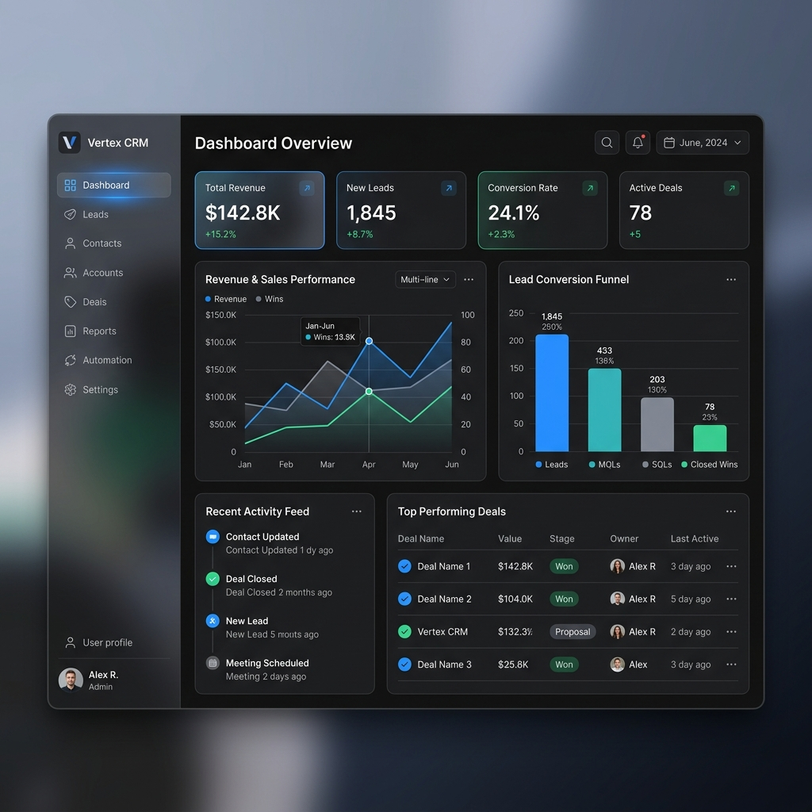
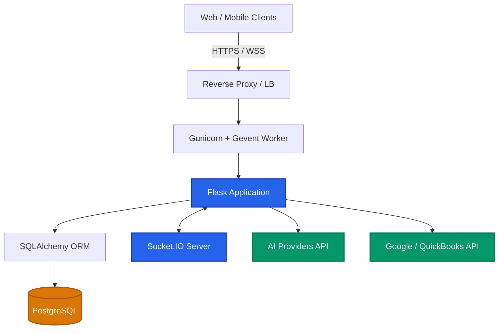

<div align="center">

# ✨ Future SaaS CRM ✨

**The Next-Generation Customer Relationship Management Platform**

[](https://python.org)
[](https://flask.palletsprojects.com/)
[](https://postgresql.org)
[](https://socket.io)
[](#)

<br/>



<br/>

*A highly scalable, real-time, and AI-powered CRM solution designed to streamline business workflows, automate tasks, and provide deep customer insights.*

</div>

---

## 🌟 Key Features

### 🔐 Enterprise-Grade Security
* **Robust Authentication**: Powered by `Flask-Login` with strong password hashing and session management.
* **Threat Protection**: Rate-limiting against brute force attacks and comprehensive CSRF protection using `Flask-WTF`.
* **Access Control**: Fine-grained permissions and API authentication via JWTs.

### ⚡ Real-Time Collaboration
* **Live Updates**: Built on `Flask-SocketIO` and `gevent`, ensuring instant updates across your entire team.
* **Notifications**: Push notifications for immediate pipeline and activity alerts without page reloads.

### 🤖 AI-Powered Assistants
* **Multi-Model Support**: Native integrations with **Anthropic**, **Google Generative AI**, and **Groq**.
* **Smart Automations**: AI-driven email drafting, sentiment analysis, and intelligent workflow routing.

### 🔗 Deep Integrations
* **Google Workspace**: Seamless two-way sync with Google Calendar and Contacts via OAuth.
* **Finance**: Direct integration with **QuickBooks** for invoicing and accounting sync.
* **Communication**: Built-in **Telegram Bot** integration for alerts and customer interaction.

---

## 🏗️ Project Architecture

Our backend relies on a scalable, event-driven architecture designed to handle real-time concurrency efficiently.



---

## 📂 Directory Structure

A clean, modular monolith structure for optimal maintainability:

```text
saas-crm-future/
├── admin_panel/        # Administrative interfaces and management dashboard
├── docs/               # Documentation and visual assets
│   └── assets/         # Images, diagrams, and media
├── migrations/         # Alembic database migration scripts
├── models/             # SQLAlchemy ORM definitions
│   ├── models_crm.py
│   ├── models_automation.py
│   └── models_contact_timeline.py
├── routes/             # API endpoints and application controllers
│   ├── api.py          # Internal REST API
│   ├── public_api.py   # External-facing documented API
│   ├── auth.py         # Authentication & Authorization
│   ├── automation.py   # Workflow logic
│   └── webhook.py      # Third-party incoming webhooks
├── scripts/            # Utility scripts for database and maintenance
├── services/           # Business logic and external API integrations
├── static/             # Frontend assets (CSS, JS, Fonts, Images)
├── templates/          # Jinja2 HTML templates
├── tests/              # Automated unit and integration tests
├── app.py              # Application factory and entry point
├── config.py           # Environment and app configuration
└── requirements.txt    # Python dependencies
```

---

## 🚀 Getting Started

### Prerequisites
* **Python** 3.10 or higher
* **PostgreSQL** (or SQLite for quick local testing)
* **Git**

### Installation Steps

1. **Clone the repository**
   ```bash
   git clone https://github.com/lordon1a/saas-crm-future.git
   cd saas-crm-future
   ```

2. **Set up Virtual Environment**
   ```bash
   python -m venv venv
   source venv/bin/activate  # On Windows: venv\Scripts\activate
   ```

3. **Install Dependencies**
   ```bash
   pip install -r requirements.txt
   ```

4. **Environment Configuration**
   Create a `.env` file in the root directory:
   ```env
   FLASK_APP=app.py
   FLASK_ENV=development
   SECRET_KEY=your_super_secret_key
   SQLALCHEMY_DATABASE_URI=sqlite:///dev.db # Change for production
   ```

5. **Database Initialization**
   ```bash
   flask db upgrade
   ```

6. **Start the Development Server**
   ```bash
   flask run
   ```

> [!TIP]
> **Production Deployment:** For production environments, do not use `flask run`. Instead, use Gunicorn with Gevent WebSockets:
> ```bash
> gunicorn -k geventwebsocket.gunicorn.workers.GeventWebSocketWorker -w 1 app:app
> ```

---

## 🤝 Support & Contribution

Due to the proprietary nature of this platform, access is restricted. Internal team members can check the `/docs` folder for detailed contribution guidelines and coding standards.

<div align="center">
  <sub>Built with ❤️ for modern businesses.</sub>
</div>
