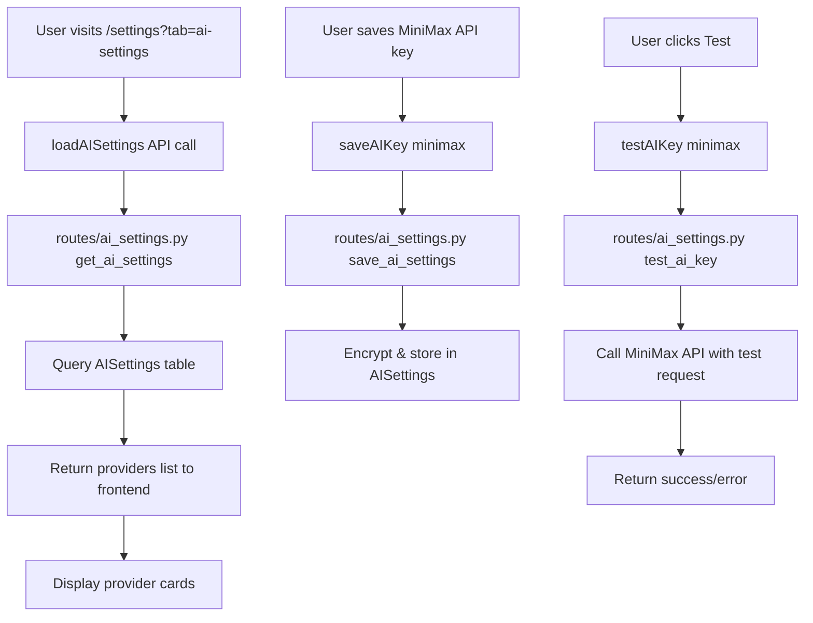

# MiniMax AI Provider Implementation Plan

## Overview
Add MiniMax as a new AI provider in the AI Settings page (`/settings?tab=ai-settings`). MiniMax has an Anthropic-compatible API, so we can use the same client approach with a custom base URL.

## MiniMax API Details
- **API Endpoint (International)**: `https://api.minimax.io/anthropic`
- **API Endpoint (China)**: `https://api.minimaxi.com/anthropic`
- **Authentication**: `x-api-key` header (same as Anthropic)
- **Default Model**: `MiniMax-M2.7`

## Files to Modify

### 1. `routes/ai_settings.py`
| Line | Change |
|------|--------|
| ~39 | Add `'minimax'` to providers list in `get_ai_settings()` |
| ~75 | Add `'minimax'` to valid providers validation in `save_ai_settings()` |
| ~203 | Add minimax test connection block in `test_ai_key()` |

### 2. `routes/ai_assistant.py`
| Change | Description |
|--------|-------------|
| Provider dict | Add `minimax_client`, `minimax_key`, `minimax_model` entries |
| Decrypt & configure | Add minimax decryption and client initialization |
| API calls | Add minimax HTTP API call logic |
| Provider priority | Update order to: Groq > OpenRouter > **MiniMax** > Gemini > Anthropic |

### 3. `templates/settings.html`
| Change | Description |
|--------|-------------|
| ~889 | Add MiniMax UI section after OpenRouter (copy OpenRouter style) |
| ~3131 | Add `'minimax'` to `clearAllAIKeys()` providers array |

### 4. `routes/settings.py` (if needed)
| Line | Change |
|------|--------|
| ~1140 | Add `'minimax'` to valid providers in AI test endpoint |

## MiniMax API Integration
```python
# MiniMax uses Anthropic-compatible API
import anthropic

# For MiniMax, we use requests directly since it has custom base URL
import requests

MINIMAX_API_URL = "https://api.minimax.io/anthropic/v1/messages"

headers = {
    "x-api-key": api_key,
    "anthropic-version": "2023-06-01",
    "content-type": "application/json",
}
payload = {
    "model": model_name or "MiniMax-M2.7",
    "max_tokens": 1024,
    "messages": [{"role": "user", "content": "Test"}]
}
response = requests.post(MINIMAX_API_URL, headers=headers, json=payload)
```

## Frontend UI
MiniMax section will use:
- **Color theme**: Purple/pink gradient (similar to MiniMax brand)
- **Icon**: `fa-robot` or custom MiniMax icon
- **Model options**: MiniMax-M2.7, MiniMax-Text-01
- **Help text**: Link to MiniMax developer platform

## Mermaid Diagram - Component Flow


## Implementation Steps
1. **Backend - ai_settings.py**: Add minimax to provider lists and test endpoint
2. **Backend - ai_assistant.py**: Add minimax client configuration and API calls
3. **Frontend - settings.html**: Add MiniMax UI card
4. **Test**: Verify all 3 operations (load, save, test) work correctly

## Verification Checklist
- [ ] GET `/api/settings/ai` returns minimax in providers list
- [ ] PUT `/api/settings/ai` accepts minimax provider
- [ ] POST `/api/settings/ai/test` successfully tests MiniMax API key
- [ ] Frontend displays MiniMax card with correct fields
- [ ] AI assistant can use MiniMax as fallback provider